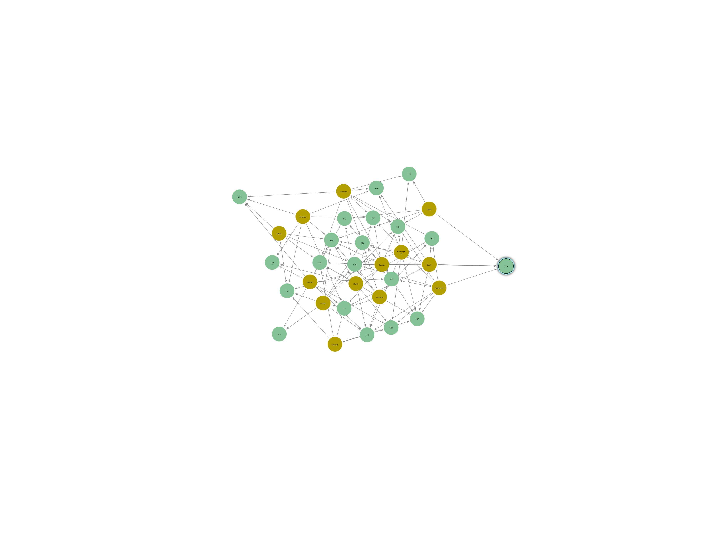

# GoMyCode – DataOps Internship

## Overview
`main.py` cleans the raw subscription data and outputs `OLAP_Cohort_Analysis.csv`.

## How to run
```bash
python main.py
## 🔷 Neo4j Graph


Voir [cypher_queries.txt](graph/cypher_queries.txt)




